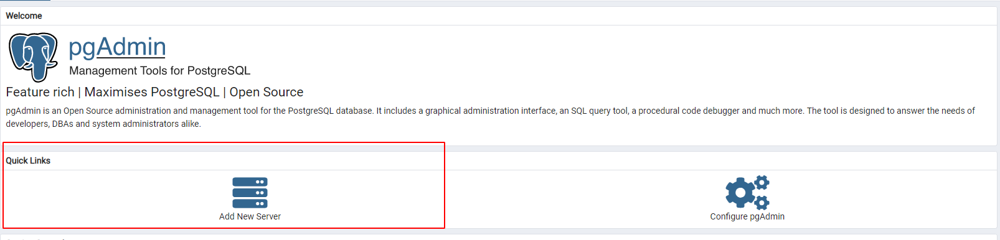
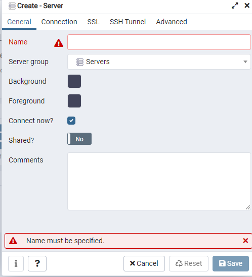
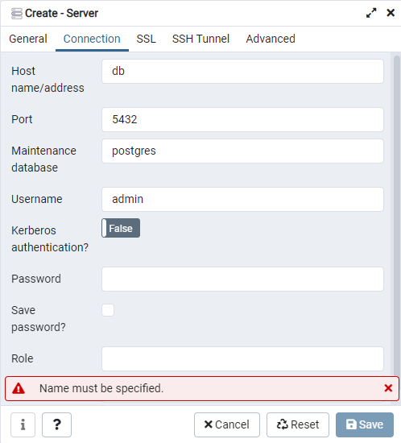

# Postgres con PGAdmin

- En primer lugar, vamos a crear nuestro archivo de configuracion con:
```bash
cp .env.template .env
```
- En el archivo .env vamos a definir nuestro usuario y contraseña de la DB, las variables son `POSTGRES_USER` y `POSTGRES_PASSWORD`
- En el archiv `.env`, vamos a tener el usuario y contraseña por defecto de PGAdmin, para cambiar estos, debemos realizar los cambios en las variables de `PGADMIN_DEFAULT_EMAIL` y `PGADMIN_DEFAULT_PASSWORD`
- Una vez configurado el archivo `.env`, procedemos a levantar los servicios con:
```bash
docker-compose up -d
```

# Configurar PGAdmin
- Una vez realizados los pasos anteriores, vamos a configurar PGAdmin para poder administrar nuestra DB
- Nuestra UI se ejecuta en: `http://localhost:5050/`
- Lo primero que hacemos va a ser, ir a `Quick Links -> Add New Server`
- 
- Esto nos despliega una ventana en la cual vamos a proceder a crear nuestra conexion
- 
- En `Name`, vamos a poner un nombre que sirva para identificar nuestra conexion. Luego de esto, cambiamos a la pestaña de `Connection`
- Estando en la pestaña de `Connection`, tenemos que cargar los valores de `Host name/address` y `Port`, por los que se muestran en la imagen
- 
- En `Username` y `Password`, vamos a completarlos con los datos que definimos en el archivo `.env` previamente, estos son `POSTGRES_USER` y `POSTGRES_PASSWORD`
